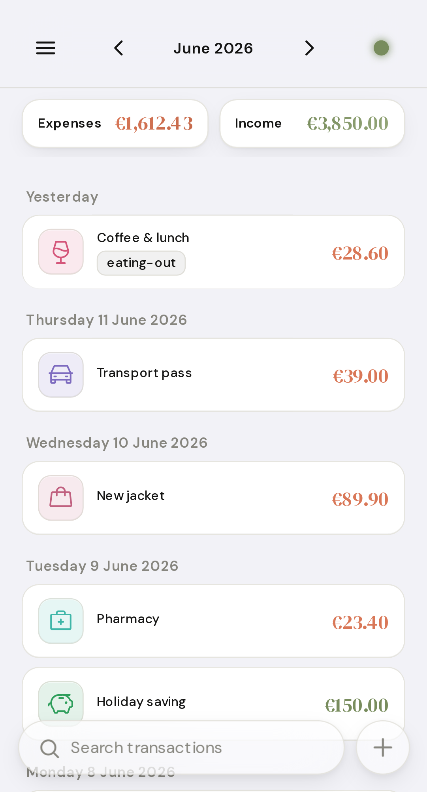
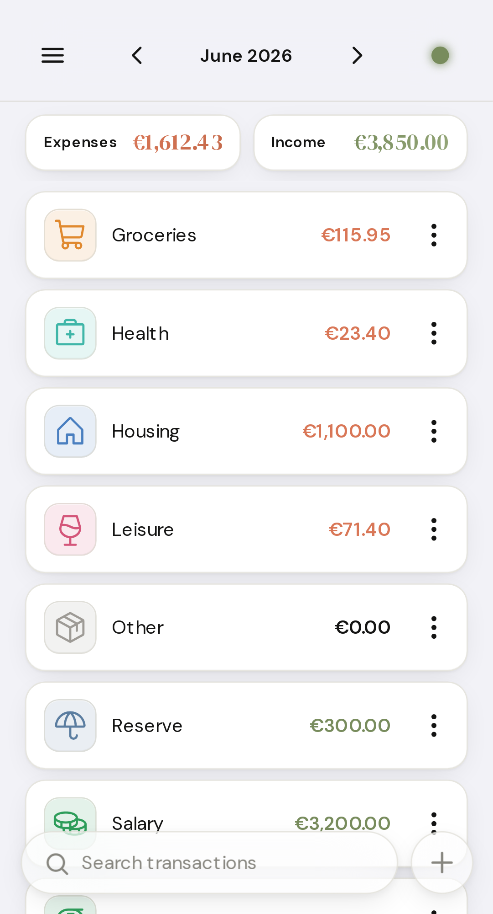
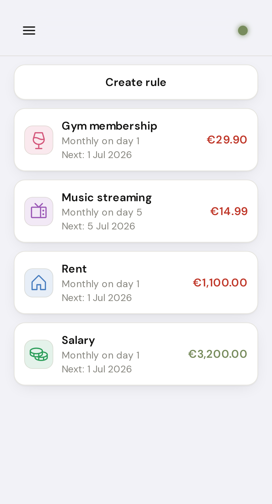
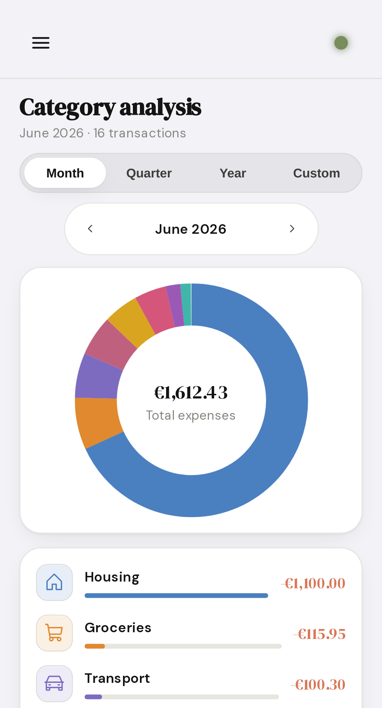
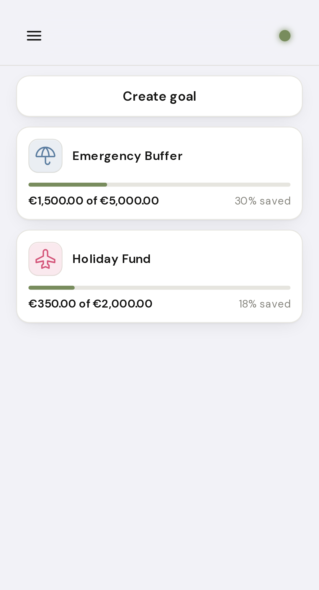
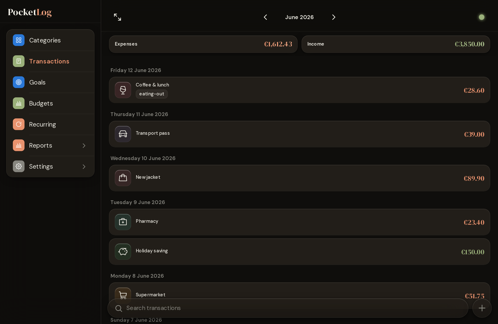

# PocketLog

A household budget book as a Progressive Web App (PWA) — runs in the browser on all
major platforms (iOS, Android, macOS, Windows, Linux) and can be installed as an app
on the home screen.

Designed for **private self-hosting**: data resides exclusively on your own server —
by default in an embedded SQLite file (no separate database required), optionally in an
external MariaDB. The app runs in your own container. All assets (fonts, icons,
JS libraries) are served from your own server — no CDN calls, no external connections,
no tracking, no telemetry.

## Screenshots

<p align="center">
  
  
  
  
  
</p>

<p align="center">
  
</p>

<p align="center"><em>Mobile — the app's primary form factor: ledger, categories, recurring rules, category analysis, savings goals. Below: the desktop sidebar layout in dark theme.</em></p>

## Contents

- [Screenshots](#screenshots)
- [Features](#features)
- [Requirements](#requirements)
- [Quick Start](#quick-start)
- [Configuration](#configuration)
- [Reverse Proxy](#reverse-proxy)
- [Login & Security](#login--security)
- [API Access](#api-access)
- [Logging & Audit Trail](#logging--audit-trail)
- [Emergency Recovery](#emergency-recovery)
- [Image](#image)
- [License](#license)

## Features

- **Transactions** — income & expenses with date, amount, category, and tags
- **Categories** — freely definable (name, icon, color); a default set is created on
  first use
- **Tags** — free-form labels per transaction; rename or delete centrally
- **Goals** — savings targets and debt tracker in one: link a goal to a category and
  PocketLog calculates your progress automatically from that category's transactions.
  Goals are tracked separately and do not affect your balance
- **Recurring transactions** — define rules for transactions that repeat (rent,
  subscriptions, salaries) and PocketLog books them automatically at the next due
  date. Frequencies daily / weekly / monthly / quarterly / yearly with a configurable
  interval, anchored to a weekday or day of the month.
  Optional end date or maximum number of occurrences; individual upcoming
  occurrences can be skipped. Rules can be paused and resumed at any time, and
  tags can be assigned to a rule so every auto-booked transaction inherits them.
  A small icon marks auto-booked transactions in the list; a notification reports
  how many were added since the last visit
- **Reports & Charts** — monthly/yearly overview, category and tag reports, trend view
  and forecast
- **Search** — full-text, category, and tag filtering in the transaction list
- **CSV Import / Export** — UTF-8 or CP1252, max. 5 MB; export all transactions as
  semicolon-delimited CSV. Import is also available over the API for automated
  workflows (see [API Access](#api-access)), with duplicate rows skipped on
  re-import so overlapping bank exports don't double-book
- **API access** — per-user **API keys** (bearer tokens) with scoped permissions
  (read, import, write) for programmatic access; lets external tools drive the
  CSV import — or full read/write sync — without a browser session
  (see [API Access](#api-access))
- **Offline capability** — app works without a connection; changes sync automatically
  when back online
- **Themes** — Light, Dark, System (saved in settings)
- **Language & Currency** — German/English with regional variants (de-DE, de-AT,
  de-CH, en-GB, en-US) control both translation *and* date/number formatting;
  display currency (EUR, USD, GBP, CHF, JPY) freely selectable. Configurable per
  user; instance default via `DEFAULT_LOCALE` / `DEFAULT_CURRENCY` (see
  [Configuration](#configuration))
- **Multi-user** — each identity has its own data; admin creates additional users
- **Built-in login** — username/password with admin role, setup flow, and
  brute-force protection

## Requirements

- Docker (or Podman)
- **Optional:** MariaDB 10.6+ (external instance) — only if you do not want to use
  the built-in SQLite database

## Quick Start

By default, PocketLog uses an embedded **SQLite database** at
`/config/db/pocketlog.db` — no separate database, no DB variables required.
Mount `/config` to the host so that data survives container updates.

### 1. Start the container

```bash
docker run -d \
  --name pocketlog \
  -p 8000:8000 \
  -e PUID=1000 -e PGID=1000 \
  -e TZ=Europe/Berlin \
  -v /mnt/user/appdata/pocketlog:/config \
  ghcr.io/anym001/pocketlog:latest
```

`PUID`/`PGID` determine which host user owns the files under `/config`
(see [Configuration](#configuration)). On Unraid, typically `PUID=99` / `PGID=100`.

### 2. Initial setup

On first access (`http://<host>:8000`) a setup screen appears. Create the first admin
account (username + password, minimum 12 characters with upper/lowercase letters, a
number, and a special character). Additional users are created by the admin under
_Settings → User Management_.

### External MariaDB (optional)

If you prefer to run an external MariaDB, create a database there …

```sql
CREATE DATABASE pocketlog CHARACTER SET utf8mb4 COLLATE utf8mb4_unicode_ci;
CREATE USER 'pocketlog'@'%' IDENTIFIED BY 'your-password';
GRANT ALL ON pocketlog.* TO 'pocketlog'@'%';
FLUSH PRIVILEGES;
```

… and set the `DB_*` variables at startup. **As soon as any `DB_*` variable is set,
PocketLog switches to MariaDB** (instead of SQLite); `DB_PASSWORD` is then required:

```bash
docker run -d \
  --name pocketlog \
  -p 8000:8000 \
  -e DB_HOST=mariadb \
  -e DB_NAME=pocketlog \
  -e DB_USER=pocketlog \
  -e DB_PASSWORD=your-password \
  -e TZ=Europe/Berlin \
  ghcr.io/anym001/pocketlog:latest
```

## Configuration

| Variable | Default | Description |
|---|---|---|
| `PUID` | `1000` | Host user ID that owns files under `/config` (Unraid: `99`) |
| `PGID` | `1000` | Host group ID for `/config` (Unraid: `100`) |
| `SQLITE_PATH` | `/config/db/pocketlog.db` | Path to the SQLite file (only without `DB_*`) |
| `DB_HOST` | `mariadb` | **MariaDB option only:** hostname or IP. Setting any `DB_*` variable switches from SQLite to MariaDB. |
| `DB_PORT` | `3306` | MariaDB option only: port |
| `DB_NAME` | `pocketlog` | MariaDB option only: database name |
| `DB_USER` | `pocketlog` | MariaDB option only: database user |
| `DB_PASSWORD` | – | MariaDB option only: password (required once MariaDB is active) |
| `DATABASE_URL` | – | Advanced: full database connection URL; overrides `DB_*`/SQLite (e.g. for SSL, socket, custom driver) |
| `TZ` | `UTC` | Container timezone |
| `LOG_LEVEL` | `INFO` | Log level (`DEBUG`, `INFO`, `WARNING`, `ERROR`). Audit events (logins, lockouts, admin actions) are at `INFO`/`WARNING`. |
| `LOG_FORMAT` | `text` | Log format: `text` (human-readable line) or `json` (one structured JSON object per line, for aggregators like Loki/ELK). Applies to both `docker logs` and `LOG_FILE`. |
| `LOG_FILE` | – | Writes logs **in addition** to `docker logs` into this file (rotating). Recommended: `/config/logs/audit.log` with a mounted `/config` directory, to retain logs across container updates (see [Logging & Audit Trail](#logging--audit-trail)). |
| `LOG_FILE_MAX_BYTES` | `10485760` | Log file rotation size in bytes (default 10 MB). |
| `LOG_FILE_BACKUPS` | `5` | Number of rotated log files to retain. |
| `DEFAULT_LOCALE` | `de-DE` | Starting locale for new accounts (BCP-47: `de-DE`, `de-AT`, `de-CH`, `en-GB`, `en-US`). Each user can override it. |
| `DEFAULT_CURRENCY` | `EUR` | Starting currency for new accounts (ISO 4217: `EUR`, `USD`, `GBP`, `CHF`, `JPY`). Display only, overridable per user. |
| `SESSION_COOKIE_SECURE` | `1` | Set to `0` if PocketLog is operated without HTTPS |
| `SESSION_LIFETIME_HOURS` | `24` | Session duration without "Stay logged in" |
| `SESSION_REMEMBER_DAYS` | `30` | Session duration with "Stay logged in" |
| `SESSION_ABSOLUTE_DAYS` | `7` | Maximum session duration (standard) |
| `SESSION_REMEMBER_ABSOLUTE_DAYS` | `90` | Maximum session duration (remember-me) |

## Reverse Proxy

PocketLog runs on port 8000 and ships with its own login — no upstream identity
provider required. Any reverse proxy can sit in front of it (nginx, Caddy, Traefik …).
Nginx example:

```nginx
server {
    listen 443 ssl;
    server_name pocketlog.example.com;

    location / {
        proxy_pass         http://localhost:8000;
        proxy_set_header   Host              $host;
        proxy_set_header   X-Real-IP         $remote_addr;
        proxy_set_header   X-Forwarded-Proto $scheme;
    }
}
```

## Login & Security

- **Password policy**: minimum 12 characters with upper/lowercase letters, a number,
  and a special character
- **Brute-force protection**: after several failed attempts an automatic lockout period
  kicks in; admins can lift it via _Reset Password_
- **Session**: active for 24 hours by default, 30 days with "Stay logged in";
  after an absolute maximum of 7 or 90 days a new login is required

## API Access

Beyond the browser, PocketLog exposes its API for programmatic access via
**API keys** (bearer tokens). The primary use case is **automated CSV import** —
for example a bridge tool that converts your bank's export and uploads it on a
schedule — without needing an interactive browser session.

### Creating a key

Open _Settings → API keys_, enter a name, choose a scope, and create the key.
The key (format `plk_…`) is **shown only once** — copy it right away; PocketLog
stores only its hash and cannot recover the original. You can revoke a key at any
time from the same screen.

Each key carries a single scope, in a hierarchy where the higher tier includes
the lower ones:

| Scope | Grants |
|---|---|
| `read` | all read endpoints (transactions, categories, tags, CSV export) |
| `import` | CSV import only (`POST /api/import/csv`) |
| `write` | full data access — every create / update / delete plus `import` and `read` |

`write` is the top data tier; there is intentionally no `admin` API scope.
**User management, the bulk-delete endpoints, and API-key management stay
session-only** — they are never reachable with a bearer token, so a leaked key
can never take over the instance or wipe all data. Keys are bound to the user
who created them and respect the same per-user data isolation as the web UI.

### Importing a CSV via the API

Send the file as multipart form data with the key in the `Authorization` header:

```bash
curl -X POST https://pocketlog.example.com/api/import/csv \
  -H "Authorization: Bearer plk_your_key_here" \
  -F "file=@transactions.csv"
```

Response:

```json
{ "imported": 12, "skipped": 0, "deduped": 0, "errors": [] }
```

The CSV uses a header row with the columns `date`, `amount`, `type`,
`description`, `category`, and `tags`; the delimiter (`;`, `,`, tab, or `|`) is
auto-detected. A ready-made example is available under _Settings → CSV import_.

**Deduplication:** every imported row gets a fingerprint derived from its date,
amount, description, and type. Re-importing an overlapping export skips rows that
are already present instead of booking them twice — those are counted under
`deduped`:

```json
{ "imported": 0, "skipped": 0, "deduped": 12, "errors": [] }
```

Unlike browser requests, bearer-token calls do **not** require the CSRF header
(a browser never sends the token automatically, so CSRF does not apply). All
other security — per-user isolation, the 5 MB / row limits, and formula-injection
guards — applies identically.

## Logging & Audit Trail

PocketLog logs security-relevant events (logins including failed attempts, lockouts,
password changes, admin user actions, deletion of all own data, and create / update /
delete / catch-up events for recurring rules). **Passwords, hashes, security tokens,
or user-supplied free-text (rule names, descriptions, amounts) are never logged.**

By default output goes to `stdout`/`stderr`, i.e. into `docker logs`.
This survives container restarts, but **not** an update with `docker rm`.
There are two approaches for a persistent audit trail:

**Option A — Log file in the app directory (in-app, simple):**

PocketLog follows the common self-hosting convention: a single app directory at
`/config` inside the container, mounted to the host. It holds the SQLite database
(`/config/db/`, unless an external MariaDB is used) and the audit trail
(`/config/logs/`) — one mount covers the entire persistent app state.

```bash
docker run -d \
  --name pocketlog \
  -p 8000:8000 \
  -e DB_HOST=mariadb -e DB_NAME=pocketlog \
  -e DB_USER=pocketlog -e DB_PASSWORD=your-password \
  -e LOG_FILE=/config/logs/audit.log \
  -v /mnt/user/appdata/pocketlog:/config \
  ghcr.io/anym001/pocketlog:latest
```

Writes **in addition** to `docker logs` into the file (rotating; size/count via
`LOG_FILE_MAX_BYTES` / `LOG_FILE_BACKUPS`). The missing directory is created
automatically. If the file is not writable, the app continues and logs only to
`stderr` (with a warning). The mounted `/config` folder persists across container
updates.

> **Unraid:** Map `/config` to `/mnt/user/appdata/pocketlog` in the template
> and set `LOG_FILE=/config/logs/audit.log` — the entire app state then lives
> under a single path in your appdata share.

**Option B — Docker log driver (platform-side, "12-Factor"):**

Let the app log to `stderr` unchanged and leave persistence to the host,
e.g. via journald:

```bash
docker run -d --name pocketlog \
  --log-driver=journald \
  … (remaining options) …
```

Logs then land in the systemd journal (`journalctl CONTAINER_NAME=pocketlog`) and
survive container updates without the app needing to manage files.

> Option A is most convenient for single instances; Option B is cleaner when a
> centralised logging infrastructure (journald, syslog, Loki …) is already in place.
> Both can be combined.

## Emergency Recovery

Forgot the admin password:

```bash
docker exec -it pocketlog python -m app.cli reset-admin-password
```

Resets the password and any lockout; a new password must be set on the next login.
`--username <name>` resets a specific account instead of the default admin.

## Image

Image: `ghcr.io/anym001/pocketlog`

| Tag | Source | Purpose |
|---|---|---|
| `:X.Y.Z` | Release tag on `main` | **Production** — fixed version, update when ready |
| `:latest` | Latest `main` state | Tracks every `main` merge |
| `:dev` | Latest `dev` state | **Maintainers only** — pre-production/staging for testing |

**Recommendation:** Pin production to a fixed `:X.Y.Z` tag (not `:latest`),
so a new `main` merge does not silently update your instance — and rollback is
trivial (point to the old tag). A **staging** instance can track `:dev`
(or `:latest`) to review changes before production. The branching and release
workflow is described in [`CONTRIBUTING.md`](CONTRIBUTING.md).

## License

PocketLog is released under the **GNU Affero General Public License v3.0**
(AGPL-3.0). You may use, redistribute, and modify the software — if you offer a
(modified) version as a networked service, you must make the complete source code
available (AGPL §13). The full license text is in [`LICENSE`](LICENSE).

Copyright (C) 2026 anym001

---

Built with [Claude Code](https://claude.ai/code)
